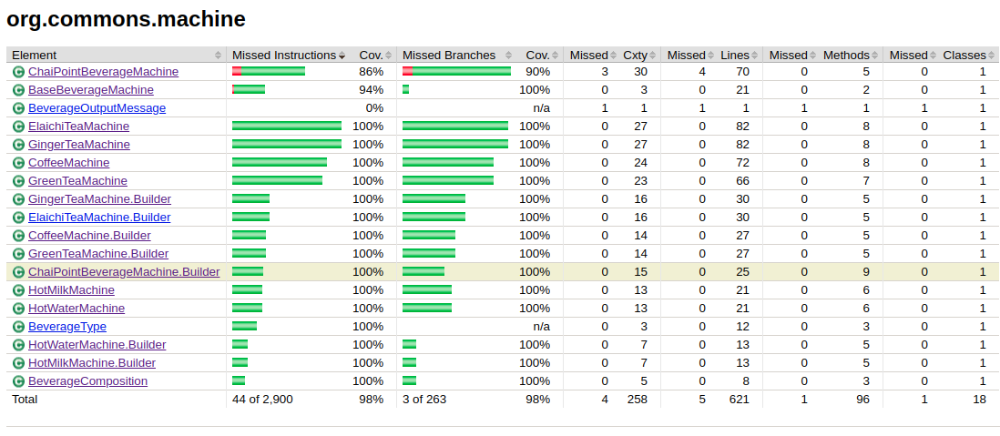

# beverage-machine
Library that implements functionality of beverage machine.

Problem description can be found in [Link](archive/README.md)

**Design philosophy:**

Build pluggable modules for maximum reuse and extensibility of code.

1. Build N outlet dispensing module with bare metal beverage machine. This
machine only has connection point for pluggable brewing machines.
2. Build brewing machines which has connection point pluggable ingredient
containers.
3. Build pluggable ingredient containers.
4. Interconnect N outlet dispensing machine with brewing machine and connect 
the brewing machine with ingredient containers to build a beverage brewing 
machine.
5. Build custom brewing machine with more more than one brewing module by
interconnecting N outlet dispensing machine with mutliple brewing machine
and connect these brewing machines with a set of required ingredient containers
to dispense multiple beverages to N people paralelly.

The modular design will look like this:


**Structure of the code:**

With code modularity and its reuse and extensibility in mind, I built the complete 
system in the form of inter pluggable component. First step started with
the drawing of sketch of the functionality offered by a beverage machine and 
that became the part of beverage machine interface - 
[BeverageMachine](src/main/java/org/commons/machine/BeverageMachine.java).
 
Using this the first module was brought into existence which had N outlets 
with bare metal feature of a pluggable beverage machine - 
[BaseBeverageMachine](src/main/java/org/commons/machine/BaseBeverageMachine.java) 


Then we finalized on functionality of an pluggable ingredient container by building
an interface - 
[IngredientContainer](src/main/java/org/commons/ingredients/IngredientContainer.java).
Then we built [ConcreteIngredientContainer](src/main/java/org/commons/ingredients/ConcreteIngredientContainer.java)
on the interface to provide a common container for all ingredients.

Then we build core concrete brewing machines using N-outlet bare metal beverage
machine multiple ingredient containers as per need.
For example -
1. [HotWaterMachine](src/main/java/org/commons/machine/HotWaterMachine.java)
2. [HotMilkMachine](src/main/java/org/commons/machine/HotMilkMachine.java)
3. [GreenTeaMachine](src/main/java/org/commons/machine/GreenTeaMachine.java)
4. [GingerTeaMachine](src/main/java/org/commons/machine/GingerTeaMachine.java)
5. [ElaichiTeaMachine](src/main/java/org/commons/machine/ElaichiTeaMachine.java)
6. [CoffeMachine](src/main/java/org/commons/machine/CoffeeMachine.java)

Now we build a custom beverage machine, "Chai point Machine", which serves -
1. hot water
2. hot milk
3. green tea
4. ginger tea
5. elaichi tea
6. hot coffee

Since we have already built systems which serves us all the above beverages 
separately. So we will inject brewing modules of  - 
[HotWaterMachine](src/main/java/org/commons/machine/HotWaterMachine.java),
[HotMilkMachine](src/main/java/org/commons/machine/HotMilkMachine.java)
[GreenTeaMachine](src/main/java/org/commons/machine/GreenTeaMachine.java)
[GingerTeaMachine](src/main/java/org/commons/machine/GingerTeaMachine.java)
[ElaichiTeaMachine](src/main/java/org/commons/machine/ElaichiTeaMachine.java)
[CoffeMachine](src/main/java/org/commons/machine/CoffeeMachine.java)
into ChaipointBeverage machine and plug ingredient containers for - 
water,milk,green mixture,tea leaves syrup, ginger syrup,elaichi syrup,
coffee syrup,sugar syrup. Hence constructing a custom beverage machine
using injection of modules.  

[BeverageComposition](src/main/java/org/commons/ingredients/BeverageComposition.java)
 is the recipe book of a beverage and tells quantity of ingredients needed
to prepare a particular beverage. So there are will a beverageComposition instance
for green tea, there can be a different beverage composition for hot coffee, a 
different beverage composition for chai point's green tea.


[BeverageType](src/main/java/org/commons/machine/BeverageType.java)
enumerates all the type of beverages supported by our library. If we want to
add a new beverage, this will be the starting point where we will add an enum
for the corresponding beverage type.

[IngredientType](src/main/java/org/commons/ingredients/IngredientType.java) 
enumerates all the types of ingredient supported by our library which serves
as the ingredients to prepare a beverage. The ingredient types are -
1. water
2. milk
3. green mixture
4. tea leaves syrup
5. elaichi syrup
6. ginger syrup
7. coffee syrup

**Class diagram:**


**Functional Testing "Test-Coverage":**

Testing is done by reading input_test.json and testing all beverage machine classes 
using the data in this file. The file looks like:

```
{
  "machine": {
    "outlets": {
      "count_n": 3
    },
    "total_items_quantity": {
      "hot_water": 500,
      "hot_milk": 500,
      "ginger_syrup": 100,
      "sugar_syrup": 100,
      "tea_leaves_syrup": 100
    },
    "beverages": {
      "ginger_tea": {
        "hot_water": 200,
        "hot_milk": 100,
        "ginger_syrup": 10,
        "sugar_syrup": 10,
        "tea_leaves_syrup": 30
      },
      "hot_coffee": {
        "hot_water": 100,
        "hot_milk": 400,
        "sugar_syrup": 50,
        "coffee_syrup": 30
      },
      "elaichi_tea": {
        "hot_water": 300,
        "hot_milk": 100,
        "sugar_syrup": 50,
        "tea_leaves_syrup": 30,
        "elaichi_syrup": 30
      },
      "green_tea": {
        "hot_water": 100,
        "ginger_syrup": 30,
        "sugar_syrup": 50,
        "green_mixture": 30
      },
      "hot_water" : {
        "water" : 50
      },
      "hot_milk" : {
        "milk" : 50
      }
    }
  }
}
```
The testing is done using [Junit](https://junit.org/junit5/) and coverage report is generated using [Jacoco](https://www.eclemma.org/jacoco/).

Report:




**How to run test and generate report**

Using git and maven:

```
git clone git@github.com:maskofG/beverage-machine.git
cd beverage-machine
mvn clean
mvn test
(now check index.html in target/test-coverage-report/ directory generated by jacoco plugin)
```

Downloading and then using maven:

```
wget https://github.com/maskofG/beverage-machine/archive/master.zip;
unzip beverage-machine-master.zip
cd beverage-machine
mvn clean
mvn test
```


